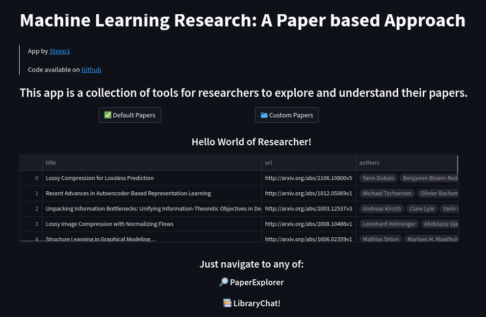

# Researcher App
An app that aims to organize your research: *A Researcher with a Paper Based Approach*

> Author: @stepp1
> 
> 
> 🚨 DISCLAIMER: 
> 
> This is a WIP. I worked on it for two weeks and wanted to have an MVP fast. When I started it, I didn't have any experience with Streamlit nor LangChain.
> 
> Any feedback is welcome!

<center> </img></center>

Currently, the app supports the following features:

* 📚 LibraryChat: a chatbot that helps you understand a collection of papers. Powered by [🦜️🔗 LangChain](https://github.com/hwchase17/langchain), 
[🤗 Hugging Face Instructor](https://huggingface.co/hkunlp/instructor-large), and [🤖 OpenAI](https://openai.com/).
* 🔎 PaperExplorer: a tool to explore papers in your library. Powered by [🤗 Hugging Face Instructor](https://huggingface.co/hkunlp/instructor-large) and [Plotly](https://plotly.com/).

# Table of Contents
- [Status](#status)
- [Installation](#installation)

# Status
* TODOs:
  - Add: PaperChat: a chatbot that helps you understand a single paper
  - Improve: Full Text Extraction
  - Improve: Data Pipelines
  - App: Decide if re-implement in a more flexible framework (e.g. Flask or FastAPI)
  - App: Include pdf viewer when clicking on a paper
  - Testing: add tests for data processing, embeddings, etc.

# Installation

You will need a `.env` file with the required keys: `HUGGINGFACEHUB_API_TOKEN`, `OPENAI_API_KEY`.

1. Clone the repository
```bash
git clone git@github.com:stepp1/research-app.git
``` 

2. Install the dependencies using conda/mamba
```bash
conda env create -f environment.yml
```

3. Activate the environment
```bash
conda activate researcher
```

4. Run the apps
```bash
chmod +x run.sh
./run.sh
```

Remember to forward the port for streamlit if you are running it on a server!

# Dataset

We provide a `dataset.json` file stored at `researcher/data/` that contains the metadata of the papers.

Full dataset is currently hosted on Zenodo: https://zenodo.org/record/7653458

More information about the dataset can be found in the [DATA.md](./DATA.md) file.

## Download the dataset

- Download the `dataset.json` file only:
```bash
curl -L https://zenodo.org/record/7653458/files/dataset.json -o researcher/data/dataset.json
``` 

- Download the `dataset.json` file and the images:
```bash
curl -L https://zenodo.org/record/7653458/files/data.tar.xz | tar -xJ -C researcher/data/
```
