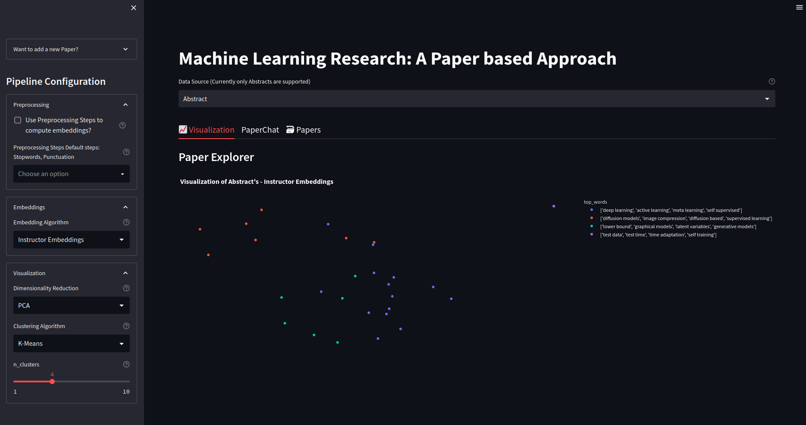

# Researcher App
An app that aims to organize your research: *A Researcher with a Paper Based Approach*

<center> </img></center>

Author: @stepp1


# Table of Contents
- [Status](#status)
- [Installation](#installation)

# Status
- TODOs:
  - Title and Full Text embeddings
  - Better Viz

# Installation
1. Clone the repository
```bash
git clone ...
``` 

2. Install the dependencies using conda/mamba
```bash
conda env create -f environment.yml
```

3. Activate the environment
```bash
conda activate researcher-app
```

4. Run the app
```bash
streamlit run app.py
```

Remember to forward the port for streamlit if you are running it on a server!

# Dataset

Data is sourced from PDFs of different papers stored in `researcher/data/pdf/`.

Also, we provide a `dataset.json` file stored at `researcher/data/` that contains the metadata of the papers:
  - `title`: title of the paper
  - `authors`: list of authors
  - `abstract`: abstract of the paper
  - `url`: url of the paper
  - `file`: path to the PDF file
  - `images`: path to the images extracted from the PDF file

As distributing the PDF files is quite cumbersome, we provide a script to download the `dataset.json` file and the images from the PDF files.

Data is currently hosted on Zenodo: https://zenodo.org/record/7653458

## Download the dataset

- Download the `dataset.json` file only:
```bash
curl -L https://zenodo.org/record/7653458/files/dataset.json -o researcher/data/dataset.json
``` 

- Download the `dataset.json` file and the images:
```bash
curl -L https://zenodo.org/record/7653458/files/data.tar.xz | tar -xJ -C researcher/data/
```

## Extract text from the images
> TODO
We provide a script to extract text from the images stored in `researcher/data/images/`.

```bash
python utils/extract_text.py
```


## Download the PDF files

> TODO
We provide a script to download the PDF files from the `dataset.json` file.

```bash
python utils/download_pdfs.py
```


