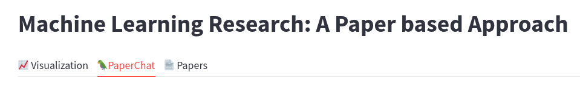
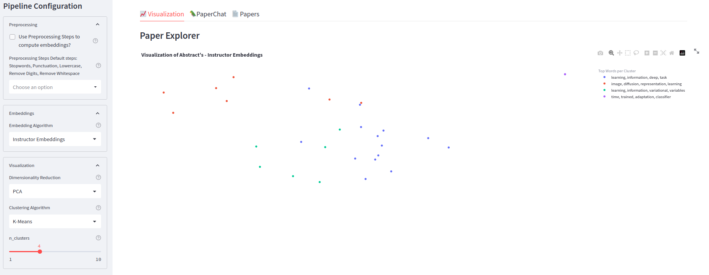
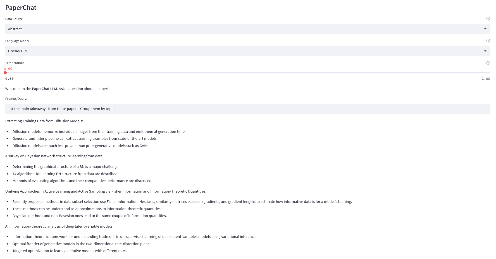

# Researcher App
An app that aims to organize your research: *A Researcher with a Paper Based Approach*

Author: @stepp1


<center> </img></center>
<center> </img></center>
<center> </img></center>


# Table of Contents
- [Status](#status)
- [Installation](#installation)

# Status
- TODOs:
  - Improve: full text extraction
  - Improve: data pipelines
  - App: move to a more flexible framework (e.g. Flask)
  - App: hide sidebar when not in use
  - App: add a "per paper" chat w/ pdf viewer

# Installation
1. Clone the repository
```bash
git clone git@github.com:stepp1/research-app.git
``` 

2. Install the dependencies using conda/mamba
```bash
conda env create -f environment.yml
```

3. Activate the environment
```bash
conda activate researcher
```

4. Run the app
```bash
streamlit run app.py
```

Remember to forward the port for streamlit if you are running it on a server!

# Dataset

We provide a `dataset.json` file stored at `researcher/data/` that contains the metadata of the papers.

Full dataset is currently hosted on Zenodo: https://zenodo.org/record/7653458

More information about the dataset can be found in the [DATA.md](./DATA.md) file.

## Download the dataset

- Download the `dataset.json` file only:
```bash
curl -L https://zenodo.org/record/7653458/files/dataset.json -o researcher/data/dataset.json
``` 

- Download the `dataset.json` file and the images:
```bash
curl -L https://zenodo.org/record/7653458/files/data.tar.xz | tar -xJ -C researcher/data/
```